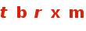

# JCSS (Rust)

JCSS stands for *JAccount Captcha Solver Service*.

This is the Rust version of [JCSS](https://github.com/PhotonQuantum/jcss).

## Usage



``` shell script
$ docker-compose up -d
$ curl -F "image=@captcha.jpeg" localhost:8000
{"status":"success","data":{"prediction":"tbrxm","elapsed_time":40}}
```

## License

This project is licensed under the [MIT License](LICENSE).